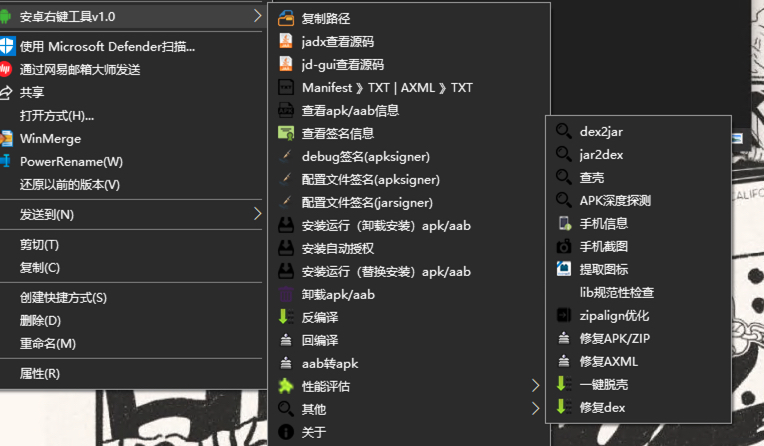

# APKmenuTOOL - 安卓右键工具

## **安卓右键工具v1.0版本使用说明**

``是之前开源的一个工具，但是现在没有了，重新整理了下，发出来用用。``

安卓右键工具是一款集合复制路径，Dex转Jar，Manifest和AXML查看，APK相关信息提取、优化、签名、反编译、回编译，手机信息查看、屏幕截图等功能的综合型工具。
### 一、运行环境
1. Windows操作系统64位
2. 需安装Java开发环境并配置环境变量
3. Python已经内置

### 二、安装和卸载说明
#### 1、安装
以管理员权限运行src/bin/install.bat。会自动“添加到系统右键菜单”，安装完毕。

#### 2、卸载
以管理员权限运行src/bin/uninstall.bat。

### 三、使用方法
使用该工具时需选中文件，右击，在弹出的菜单项中选择安卓右键工具，然后选择需要使用的功能即可。

### 四、功能说明

#### 1、复制路径
复制被选中文件的路径（全文件路径，支持多个文件）到剪贴板，执行结果将在右下角冒泡提示。

#### 2、jadx查看源码
使用jadx查看app源码

#### 3、jd-gui查看源码
使用jd-gui查看app源码

#### 4、Manifest->TXT|AXML->XML
自动提取APK文件中的AndroidManifest.xml文件内容（若为AXML文件则直接提取文件内容），以TXT文件格式保存到当前目录，并自动打开生成的TXT文件。执行结果将在右下角冒泡提示。

#### 5、查看APK/abb信息
自动提取APK文件中软件名称、包名、版本、启动Activity、权限列表等信息。任务完成时自动显示获取的信息，执行结果将在右下角冒泡提示。

#### 6、查看签名信息
自动提取APK文件的签名信息，任务完成时在当前目录下生成文件名为”源文件名_signinfo“的文本文件，，并自动打开生成的TXT文件。执行结果将在右下角冒泡提示。

#### 7、debug签名
对选中的APK文件进行签名。默认使用debug签名，签名文件可以自由配置，路径为D:\APKmenuTOOL\tools\sign。任务完成时将在当前目录下生成文件名为“源文件名”的APK文件和文件名为“源文件名_sign”的log文件。执行结果将在右下角冒泡提示。

#### 8、配置文件签名(apksigner)
对选中的APK文件使用apksigner进行签名。

#### 9、配置文件签名(jarsigner)
对选中的APK文件使用jarsigner进行签名。

#### 10、安装运行（卸载安装）
自动卸载被选中APK，然后将该APK安装到手机。使用该功能时，请先连接手机设备。执行结果将在右下角冒泡提示。

#### 11、安装自动授权（卸载安装）
将被选中APK（adb携带-g参数）安装到手机。使用该功能时，请先连接手机设备。执行结果将在右下角冒泡提示。

#### 12、安装运行（替换安装）
将被选中APK覆盖安装到手机。使用该功能时，请先连接手机设备。执行结果将在右下角冒泡提示。

#### 13、卸载apk/aab
从手机中卸载被选中APK文件。使用该功能时，请先连接手机设备。执行结果将在右下角冒泡提示。

#### 14、反编译
对被选中APK进行反编译。任务完成时会在当前目录下生成和被选中APK名字一样的文件夹。执行结果将在右下角冒泡提示。

#### 15、回编译
对反编译后的APK文件夹进行回编译得到APK文件。任务完成时会在当前目录下生成编译后的APK文件。执行结果将在右下角冒泡提示。

#### 16、aab转apk
将aab转换为apk

#### 17、性能评估
对选中的apk进行性能评估，包含首次启动时间、再次启动时间、直接启动时间(不安装)、内存占用、CPU消耗

#### 18、Dex->Jar
将dex(或APK中的dex）文件转为jar文件。任务完成时会在当前目录下生成文件名为源文件名的jar文件，并自动使用jd-gui打开所生成的jar文件。执行结果将在右下角冒泡提示。

#### 19、Jar-dex
将jar文件转为dex文件。任务完成时会在当前目录下生成文件名为源文件名的dex文件，并自动使用jd-gui打开所生成的dex文件。执行结果将在右下角冒泡提示。

#### 20、查壳
检测APK文件是否被加壳，若被加壳则检测加壳厂家。任务完成时自动显示获取的信息，执行结果将在右下角冒泡提示。

#### 22、 手机信息
自动获取手机类型、系统版本、系统API版本、系统CPU类型、序列号、IMEI、分辨率等信息，任务完成后将自动显示获取到的手机信息，使用该功能时请先连接手机设备。执行结果将在右下角冒泡提示。

#### 23、 手机截图
对手机当前画面进行截图，任务完成时会在当前目录下生成screenshot.png，同时复制截图至剪贴板。执行结果将在右下角冒泡提示。

#### 24、提取图标
提取源文件APK中的图标，任务完成时会在当前目录下生成APK中所有分辨率的目标文件。执行结果将在右下角冒泡提示。

#### 25、lib规范检查
显示被选中APK中lib目录下so文件的组织结构，并判断lib目录下的SO文件配置是否规范。

#### 26、zipalign优化
对源文件进行优化，使程序运行更快。任务完成时会在当前目录下生成文件名为“源文件名_align”的APK文件。执行结果将在右下角冒泡提示。

#### 27、修复APK/ZIP
尝试修复被破坏或畸形的APK/ZIP。任务完成时会在当前目录下生成名为“源文件名_apktool_repaired.apk(zip)”的文件。执行结果将在右下角冒泡提示。

#### 28、修复AXML
尝试修复被破坏或畸形的AndroidManifest.xml。任务完成时会在当前目录下生成名为“源文件名.bak”的备份文件。执行结果将在右下角冒泡提示。

#### 29、一键脱壳
将选中的apk进行脱壳

#### 30、修复dex
使用dexfix对文件格式错的dex文件进行修复

